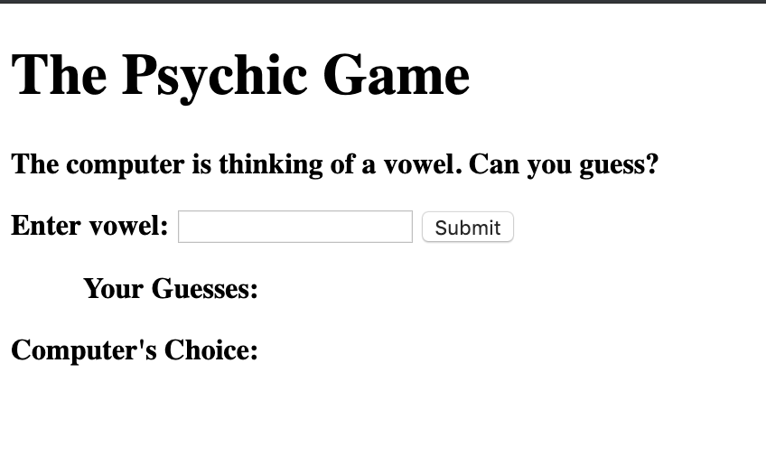
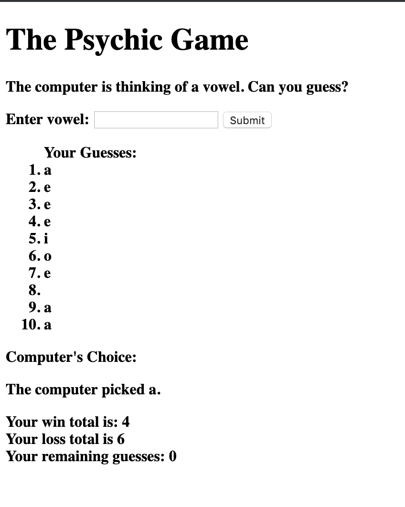

# Psychic-Game

## Page previews: 

## About the project:
  * Created a guessing game where the computer randomly picks a vowel randomly. The user must type a letter in the input field and submit it. If the user and computer picks the same vowel, the user wins. Otherwise the user loses. Wins, losses and guesses remaining are tracked.

## Techologies used to build:
  * HTML
  * Javascript

## Methodology:
  I wanted to get the easier homework assignment completed first before trying the harder one.

  I created an array of vowels for the computer to pick from (entire alphabet was too long to guess a match). I used the math.floor(math.round) method to get the computer to randomly pick a vowel.
  
  The user is asked to input a value on the DOM into an input field and then submit their guess via button element. I then created an event listener function that, when fired, to compare the user input.value to the random computer guess. It also appends the user's guesses to the DOM so the user can see what they guessed

  If there is a match, the user's score increases and the user's guesses remaining decreases. The DOM also displays what the computer guessed. 

