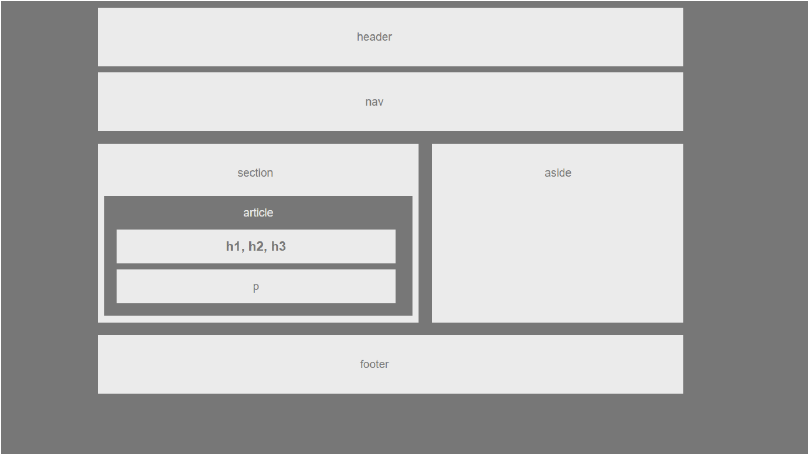

# HW-Wireframe

## Page preview (Mine): 

## Page preview (Mockup from Class): 

## About the project:
  * I remade the HW-Wireframe using floats and clearfix. No grids.
  * For our first homework assignment, we had to make a replica of a basic wireframe. We were given the following specs:

  * Needs to have:
    * Header
    * Nav
    * Aside (With a Heading)
    * Section (With a Heading)
    * Article (With a Heading) contained within the Section
    * Headers contained within the Article
    * Paragraph contained within the Article

  * CSS should have styles for each of the following elements:
    * Body
    * font-family: 'Arial', 'Helvetica Neue', Helvetica, sans-serif;
    * color: '#777'
    * background: '#777'
    * width: '960px'
    * font-size: '18px'
  
  * Header, Nav, Section, Aside, and Footer
    * background: '#ebebeb'

  * Article
    * color: '#ebebeb',
    * background: '#777'

  * h1 and p
    * color: '#777',
    * background: '#ebebeb'

  * The width of the section should be:

    * section: 495px

## Techologies used to build:
  * HTML
  * CSS

## Methodology:

I basically trashed the old html and css files and started from scratch. After reviewing class notes on floats, positioning, clearfix and the box-model, I created the required elements and associated classes. I also made id's taregeting the text so I could position the text accordingly.

